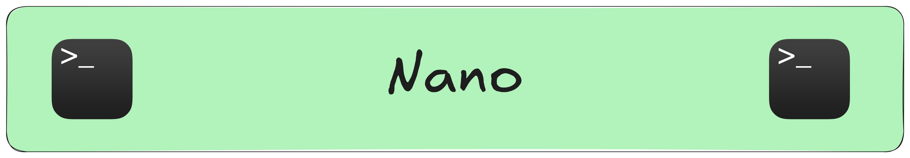
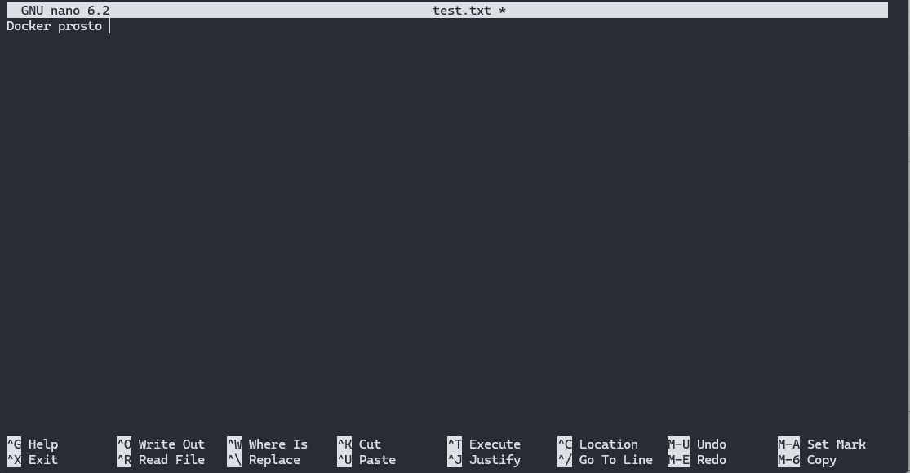

``Nano`` — это текстовый редактор, работающий в терминале, который отличается простотой использования и интуитивно понятным интерфейсом. В этом уроке мы подробно рассмотрим не только базовые, но и продвинутые функции Nano, которые помогут вам эффективно редактировать файлы прямо из командной строки.

### **Запуск и базовый интерфейс**  

Запустить Nano очень просто. Для этого достаточно выполнить команду:
```
nano
```
                  
При запуске открывается пустой экран редактора, где вы можете начать ввод текста. Если необходимо открыть существующий файл, укажите его имя:  

```
nano filename.txt
```
                  
+ Если файл существует, он будет открыт для редактирования.
+ Если файла нет, Nano создаст его при сохранении.
### **Основные горячие клавиши**
Для работы в Nano используется множество комбинаций клавиш. Вот основные из них:

+ ``CTRL + O`` — сохранить изменения (write out).
+ ``CTRL + X`` — выйти из Nano (exit); если есть несохраненные изменения, вам предложат сохранить их.
+ ``CTRL + R`` — вставить содержимое другого файла (read file) в текущий документ.
+ ``CTRL + W`` — поиск по тексту (search).
+ ``CTRL + K`` — вырезать текущую строку (cut).
+ ``CTRL + U`` — вставить ранее вырезанный или скопированный текст (uncut).
+ ``CTRL + G`` — открыть справку, где перечислены все команды Nano.
```
CTRL + O — это сохранение файла (Write Out). Не путайте с CTRL + S — он в Nano не используется.
```


### **Продвинутое редактирование текста**

Кроме базовых операций, ``Nano`` предлагает ряд продвинутых функций для более удобного редактирования:

+ **Выделение текста:** Чтобы начать выделение, нажмите ``ALT + A``. Затем перемещайте курсор для выбора нужного блока текста. После выделения можно вырезать (``CTRL + K``), копировать или вставлять текст (``CTRL + U``).
+ **Отмена и повтор действий:** В последних версиях ``Nano`` есть возможность отмены изменений. Для отмены нажмите ``ALT + U``, а для повтора — ``ALT + E``. Это позволяет вернуться к предыдущей версии файла, если случайно сделали ошибку.
+ **Поиск и замена:** Помимо стандартного поиска (``CTRL + W``), ``Nano`` позволяет выполнить замену текста. Для этого нажмите ``CTRL + \``. Затем введите искомое слово и его замену. Это удобно при работе с большими файлами.
+ **Переход по строкам и страницам:** Перемещаться по документу можно с помощью стрелок. Для быстрого перехода между страницами используйте:
```
CTRL + Y — переход на предыдущую страницу.
CTRL + V — переход на следующую страницу.
```
+ **Переход к началу и концу строки:** Нажмите ``CTRL + A`` для перехода к началу строки и ``CTRL + E`` — к концу строки.

### **Настройки и конфигурация Nano**

Чтобы сделать работу в ``Nano`` более комфортной, можно изменить его поведение через файл настроек ``~/.nanorc``. Здесь можно задать параметры, такие как подсветка синтаксиса, отступы, нумерация строк и многое другое.

### **Пример включения подсветки синтаксиса:**
```
include /usr/share/nano/*.nanorc
```
                  
Также можно настроить поведение редактора, добавив следующие строки в ``~/.nanorc``:

+ ``set autoindent`` — автоматический отступ при переносе строки;
+ ``set nowrap`` — отключение автоматического переноса длинных строк;
+ ``set linenumbers`` — вывод нумерации строк слева;
+ ``set tabsize 4`` — установка ширины табуляции.
Чтобы включить подсветку синтаксиса, добавьте строку:
```
include /usr/share/nano/*.nanorc
```
                  
### **Запуск Nano с дополнительными опциями**
Помимо конфигурационного файла, ``Nano`` позволяет использовать опции командной строки для настройки поведения редактора при запуске:

+ ``-c``: постоянное отображение позиции курсора в нижней строке.  
```
nano -c filename.txt
```
                  
+ ``-B``: создание резервной копии файла перед изменением.  
```
nano -B filename.txt
```
                  
+ ``-w``: отключение переноса длинных строк (если не задано в конфигурации).  
```
nano -w filename.txt
```
                  
### **nano -c filename.txt — открыть файл с отображением позиции курсора.**  

### **Практические примеры использования**  

+ **Редактирование простого текстового файла:**  
```
nano notes.txt
```
                  
Создайте или откройте файл ``notes.txt`` для записи заметок.
+ **Редактирование конфигурационных файлов с правами root:**  
```
sudo nano /etc/hosts
```
                  
Редактируйте системные файлы, используя sudo для получения необходимых прав.
+ **Поиск и замена в документе:**  
```
nano document.txt
```
                  
После открытия файла нажмите ``CTRL + \`` для запуска режима замены найденного слова на новое.
+ **Работа с резервными копиями:**  
```
nano -B important.txt
```
                  
Перед внесением изменений создайте резервную копию файла.
### **Полезные советы**
+ Не забывайте регулярно сохранять изменения, используя ``CTRL + O``, чтобы избежать потери данных.
+ Изучите содержимое справки (``CTRL + G``) для ознакомления с полным списком возможностей ``Nano``.
+ Настройте файл ``~/.nanorc`` под свои нужды, чтобы сделать работу редактора еще удобнее.
+ Практикуйтесь в использовании продвинутых функций, таких как выделение, поиск и замена, чтобы ускорить процесс редактирования.
### **Итог**
 Nano — это мощный инструмент для редактирования текстовых файлов, который сочетает в себе простоту использования и возможности для продвинутой настройки. Освоив как базовые, так и продвинутые функции Nano, вы сможете эффективно работать с документами, редактировать конфигурационные файлы и выполнять сложные текстовые операции прямо из терминала.