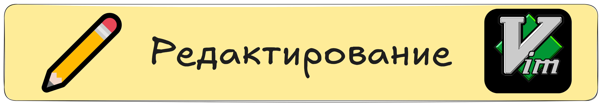

   

### **Vim — базовое редактирование**
В этом уроке мы подробнее рассмотрим базовые операции редактирования текста в ``Vim``.

Рассмотрим основные команды вставки, изменения, удаления, копирования, вставки и отмены действий.

## **Переход в режим вставки**
Чтобы начать редактирование содержимого файла, необходимо перейти в режим вставки. Вот несколько способов:

+ ``i`` — вставка перед курсором.
+ ``I`` — вставка в начале текущей строки.
+ ``a`` — вставка после курсора.
+ ``A`` — вставка в конце текущей строки.
+ ``o`` — открытие новой строки под текущей и переход в режим вставки.
+ ``O`` — открытие новой строки над текущей.
Например, чтобы добавить текст в середину строки, перейдите в нормальный режим (нажмите ``Esc``), затем переместите курсор и нажмите ``i``. После завершения редактирования снова нажмите ``Esc`` для возврата в нормальный режим.

### **Удаление текста**  

Удаление осуществляется в нормальном режиме с помощью следующих команд:

+ ``x`` — удаляет символ под курсором.
+ ``dw`` — удаляет слово от курсора до его конца.
+ ``dd`` — удаляет всю текущую строку.
+ ``D`` — удаляет всё от позиции курсора до конца строки.
Эти команды позволяют быстро удалять символы, слова и целые строки. Попробуйте, например, набрать несколько слов и затем удалить одно из них, используя ``dw``.

### **Копирование, вырезание и вставка**
Для перемещения блоков текста ``Vim`` использует команды копирования (``yank``) и вырезания (``delete``). Рассмотрим основные из них:

+ ``yy`` — копирует текущую строку.
+ ``dd`` — вырезает (удаляет) текущую строку, сохраняя её в буфере обмена.
+ ``p`` — вставляет скопированный или вырезанный текст после курсора или строки.
+ ``P`` — вставляет текст до курсора или строки.
Например, чтобы скопировать строку, нажмите ``yy``, затем переместите курсор в нужное место и нажмите ``p`` для вставки.

### **Замена и изменение текста**
Редактирование также включает замену отдельных символов или целых слов:

+ ``r`` — замена символа под курсором на другой. Например, нажмите ``r`` и введите нужный символ.
+ ``cw`` — удаляет слово от курсора до его конца и переводит вас в режим вставки для ввода нового слова.
+ ``cc`` — изменяет всю текущую строку: удаляет её содержимое и переводит в режим вставки.
Попробуйте заменить слово: переместите курсор на слово, нажмите ``cw``, введите новое слово и затем нажмите ``Esc``.

### **Отмена и повтор изменений**
+ В процессе редактирования важно уметь отменить или повторить совершенные действия:

+ ``u``— отменяет последнее действие.
+ ``CTRL + R`` — повторяет (возвращает) отмененное действие.
Эти команды помогут вам исправлять ошибки и экспериментировать с изменениями без риска потери данных.

### **Практические советы**
+ Всегда возвращайтесь в нормальный режим, нажимая ``Esc``, перед выполнением команд редактирования.
+ Экспериментируйте с различными командами на тестовом файле, чтобы привыкнуть к их работе.
+ Комбинируйте команды с числовыми параметрами для ускорения работы. Например, ``3dd`` удалит три строки подряд, а ``5yy`` — скопирует пять строк.