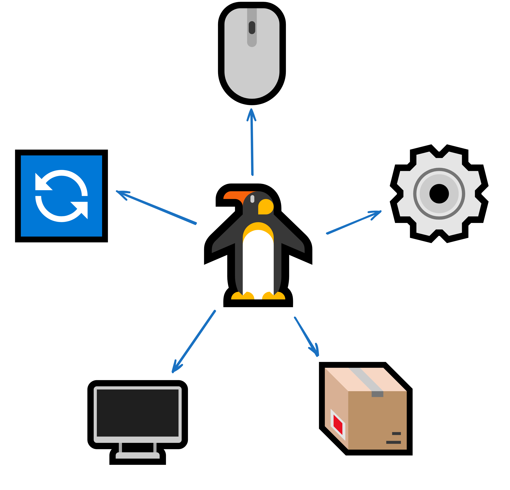

### **Что такое дистрибутив**
Дистрибутив можно представить как комплект Linux, где уже собраны и настроены программы:

+ **Ядро Linux** - сердце системы, которое управляет процессами, памятью и взаимодействием с оборудованием

+ **Базовые утилиты** - текстовые редакторы, командные оболочки, средства настройки сети идругие интсрументы
+ ** Пакетный менеджер** - система для установки, обновления и удаления приложений
+ **Графические оболочки или рабочие окружения** - RDE,GNOME, Xfce и другие
Каждый дистрибутив имеет уникальные особенности, наборы пакетов, политики обновлений и цели. Например, одни ориентированы на стабильность и корпаротивное использование, другие делают акцент на новизне и свежих версиях программ.
### Основные семейства ###

существует много дистрибутивов Linux, но можно выделить несколько «ветвей» или семейств:
1. **Debian** - одна из старейших и наиболее популярных ветвей. Примеры: Ubuntu, Linux Mint, Devuan. Отличается обширными репозиториями и большим сообществом.
2. **Red Hat** - коммерческая ветвь, фокус на корпоративный сектор. Примеры: Fedora (как экспериментальная площадка), CentOS (ранее бесплатная пересборка Red Hat), Rocky Linux. Славится стабильностью и поддержкой.
3. **SUSE** – немецкая ветвь, используемая как в открытом, так и в коммерческом формате. OpenSUSE (Leap или Tumbleweed) – пример дистрибутива, основанного на тех же наработках.
4. **Arch** – система с моделью Rolling Release, где все пакеты всегда обновлены до последних версий. Примеры: Manjaro (упрощает настройку и установку Arch).
5. **Gentoo** – компиляция пакетов из исходного кода, гибкость настроек на уровне флагов сборки.
6. **Независимые дистрибутивы** – не принадлежат никакой семье, но развиваются своими силами (Void Linux, Solus и другие).
Все они используют одно и то же ядро Linux, но по-разному собирают, тестируют и распространяют пакеты. Это объясняет, почему **в мире Linux нет «единственной правильной» версии** – каждая ветвь решает собственные задачи и ориентируется на конкретных пользователей.

### Чем дистрибутивы отличаются ###
+ **Целевая аудитория** – домашние пользователи, корпоративный сектор, геймеры, серверы, разработчики и т. д.
+ **Философия обновлений** – Rolling Release (постоянный поток свежих версий) или Stable Release (редкие крупные релизы с долгосрочной поддержкой).
+ **Среда рабочего стола** – GNOME, KDE, Xfce или другие варианты. В некоторых дистрибутивах можно выбрать окружение на этапе установки.
+ **Уровень автоматизации** – от полностью ручной конфигурации (Arch, Gentoo) до предустановленных окружений (Ubuntu, Linux Mint).
+ **Пакетный менеджер** – apt, dnf, zypper, pacman и т. д., со своими особенностями и командами.

Эти различия позволяют подобрать систему, которая идеально соответствует вашим требованиям – будь то сверхстабильный сервер с минимальной конфигурацией или современная рабочая станция с последними обновлениями.

### **Выбор Дистрибутива** ###
Не существует универсального рецепта на все случаи жизни. Однако есть несколько вопросов, на которые стоит ответить перед выбором:

+ **Какова цель использования** (рабочая станция, сервер, мультимедиа, гейминг, разработка)
+ **Нужен ли самый свежий софт** или критичнее стабильность
+ **Какая поддержка необходима** (сообщество, коммерческие службы, документация)
+ **Есть ли ограничения по ресурсам** (древний ноутбук, виртуальная машина, дата-центр)

Благодаря разнообразию семейств практически под любые требования можно подобрать подходящий дистрибутив.

### **Итог** ###
+ Дистрибутивы Linux – это готовые комплекты, включающие ядро, утилиты, пакетный менеджер и различные настройки.
Основные семейства формируют свой уникальный подход к обновлениям, пакетам и использованию.

+ Благодаря широкому выбору дистрибутивов Linux подходит для самых разных сценариев – от домашних систем до кластеров суперкомпьютеров.

+ Основные семейства формируют свой уникальный подход к обновлениям, пакетам и использованию.

+ Перед выбором дистрибутива стоит определить свои цели и потребности, сравнить несколько вариантов и изучить сообщества пользователей.
