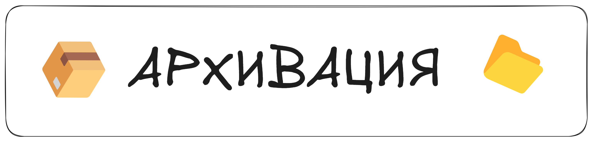

  

Для резервного копирования, переноса проектов и просто «упаковки» файлов в Linux широко используется утилита ``tar``. Первоначально это ``Tape Archive`` — архиватор для магнитных лент, но сегодня tar-файлы стали стандартом для объединения множества файлов и папок в один архив.

### **Базовая логика tar**
+ **Без сжатия:** Команда ``tar`` умеет складывать много файлов в один ``.tar`` файл (так называемый тарбол).
+ **Со сжатием:** При желании можно тут же сжать полученный архив с помощью ``gzip``, ``bzip2`` или ``xz``.  

**В итоге**, у вас может быть:

+ ``.tar`` — просто пакет файлов без сжатия
+ ``.tar.gz`` или ``.tgz`` — tar-архив, сжатый gzip
+ ``.tar.bz2`` — tar, сжатый bzip2
+ ``.``tar.xz`` — tar, сжатый xz
### **Создание архива**
+ Ключи команды ``tar`` часто указываются слитно, например ``-czvf``, где:
    + ``-c``: create (создать новый архив)
    + ``-z``: использовать gzip-сжатие
    + ``-v``: verbose (подробный вывод что пакуем)
    + ``-f``: файл (указывает, что далее идёт имя файла архива)
+ **Пример:**
```
tar -czvf archive.tar.gz папка/
```
                  
Это создаст ``archive.tar.gz``, куда упакуются все файлы и подкаталоги из ``папка/``.
+ Если не нужен ``gzip-сжатие``, можно обойтись ``-cvf`` и указать ``.tar``:  
```
tar -cvf archive.tar папка/
```
                  
### **Самые частые комбинации:**
```
tar -cvf — создать архив без сжатия.

tar -czvf — создать архив с gzip-сжатием.

tar -cjvf — создать архив с bzip2-сжатием.

tar -cJvf — создать архив с xz-сжатием.
```
### **Распаковка архива** 
+ ``-x — extract`` (извлечь):  
```
tar -xzvf archive.tar.gz
```
                  
Вы получите все файлы и каталоги в текущей директории (или укажите ``-C /путь/куда/распаковать``, если нужно другое место).  

**По умолчанию tar при распаковке сохраняет структуру директорий, права доступа (с учётом umask) и извлекает файлы в текущую директорию. Чтобы восстановить владельцев, нужен root и флаг --same-owner. Чтобы явно сохранить все права — используйте -p.**

+ Если архив не сжат (просто ``.tar``), уберите ``-z``:  
```
tar -xvf archive.tar
```
                  
### **Список содержимого**
+ ``-t`` — показать, что внутри архива, не извлекая файлы: 
```
tar -tzvf archive.tar.gz
```
                  
Перечислит файлы и папки в архиве, вместе с размерами, датами и т. д.
Быстрая проверка целостности: ``tar -tf archive.tar`` (или ``tar -tzf archive.tar.gz для gzip``); подробный вывод:  ``tar -tvf archive.tar.`` 
```
Ключ -t используется только для просмотра архива, без распаковки.
```
### **Другие форматы сжатия** 

+ ``-j`` — использовать ``bzip2`` (обычно файлы ``.tar.bz2``):
```
tar -cjvf archive.tar.bz2 папка/
tar -xjvf archive.tar.bz2
```
                  
+ ``-J`` — использовать ``xz`` (обычно файлы ``.tar.xz``):
```
tar -cJvf archive.tar.xz папка/
tar -xJvf archive.tar.xz
```
                  
 + ``-z = gzip, -j = bzip2, -J = xz``.


+ ``rar и zip`` — это отдельные программы, ``tar`` их не поддерживает напрямую.
### **Частичные извлечения**
+ Можно вынуть из архива только один файл/папку: 
```
tar -xzvf archive.tar.gz путь/к/файлу.txt
```
                  
+ В этом случае нужно знать точный путь, под которым файл хранится в архиве (используйте ``tar -t`` для просмотра).
### **Рекурсивный перенос прав и владельцев**
+ При создании ``tar`` записывает в архив структуру директорий и метаданные (права, время изменения, владельцев).
+ При извлечении права применяются по умолчанию; владельцы — если запуск от ``root`` или с флагом ``--same-owner``. Чтобы не применять права/владельцев при распаковке, используйте ``--no-same-permissions`` и ``--no-same-owner``.
### **Итог**
+ ``tar`` — классический инструмент для упаковки множества файлов в единый «тарбол».
+ ``-c, -x, -t`` — создать, извлечь или показать содержимое.
+ ``-z``, ``-j``, ``-J`` — добавляют сжатие через ``gzip``, ``bzip2`` или ``xz`` соответственно.
+ ``-v`` — подробный вывод, ``-f``— имя файла архива, ``-C`` — каталог, куда распаковывать.  

С помощью ``tar`` вы можете легко создавать резервные копии, передавать целые проекты одним файлом или архивировать логи и конфигурации. В следующем уроке мы посмотрим на сжатие данных (``gzip``, ``bzip2``, ``xz``) отдельно от ``tar`` и сравним разные алгоритмы.