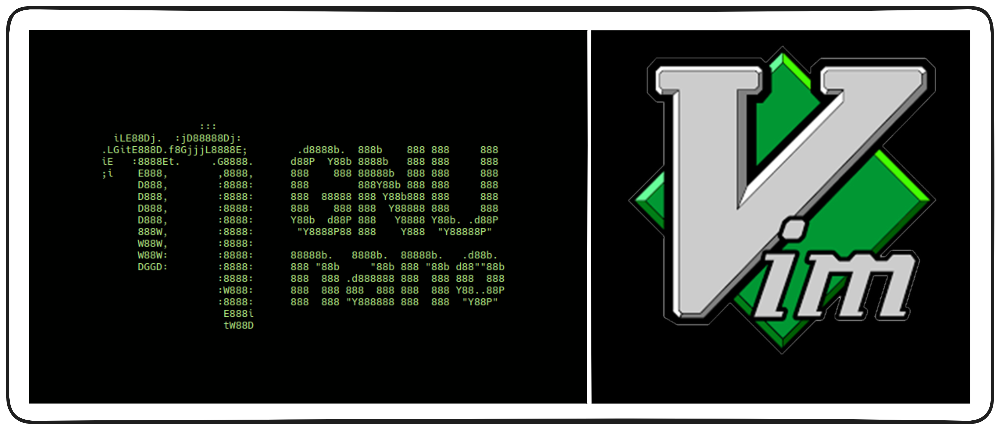

Если вы работаете в Linux, то рано или поздно столкнётесь с необходимостью редактировать текстовые файлы. Это могут быть конфигурации системы, скрипты, логи или просто заметки. И тут на сцену выходят текстовые редакторы.  

### **Почему это важно?**

1. Знание горячих клавиш и команд редакторов позволяет редактировать файлы быстрее, чем через графические интерфейсы.
2. С их помощью можно работать с файлами даже на удалённых серверах, где доступен только терминал.
3. Редакторы поддерживают макросы, скрипты и плагины, которые упрощают рутинные задачи.
### **Мы рассмотрим два редактора - Nano и Vim.**

1. ``Nano`` — простой и понятный редактор для новичков. Если вы только начинаете работать в терминале, Nano станет вашим лучшим другом.
2. ``Vim`` — настоящий "монстр" среди редакторов. Он кажется сложным на первый взгляд, но его возможности поражают. Освоив ``Vim``, вы сможете справляться с любыми задачами по редактированию текста.
### **Какие преимущества дают редакторы?**

+ Можно быстро исправить ошибку в файле и избежать проблем из-за простоя.
+ Написать скрипт или отредактировать код прямо в терминале.
+ Уверенно работать на удалённых серверах без графического интерфейса.
+ Сэкономить время при редактировании больших файлов благодаря мощным инструментам поиска и замены.