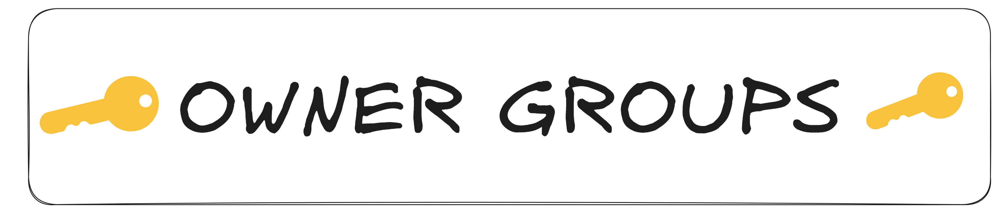
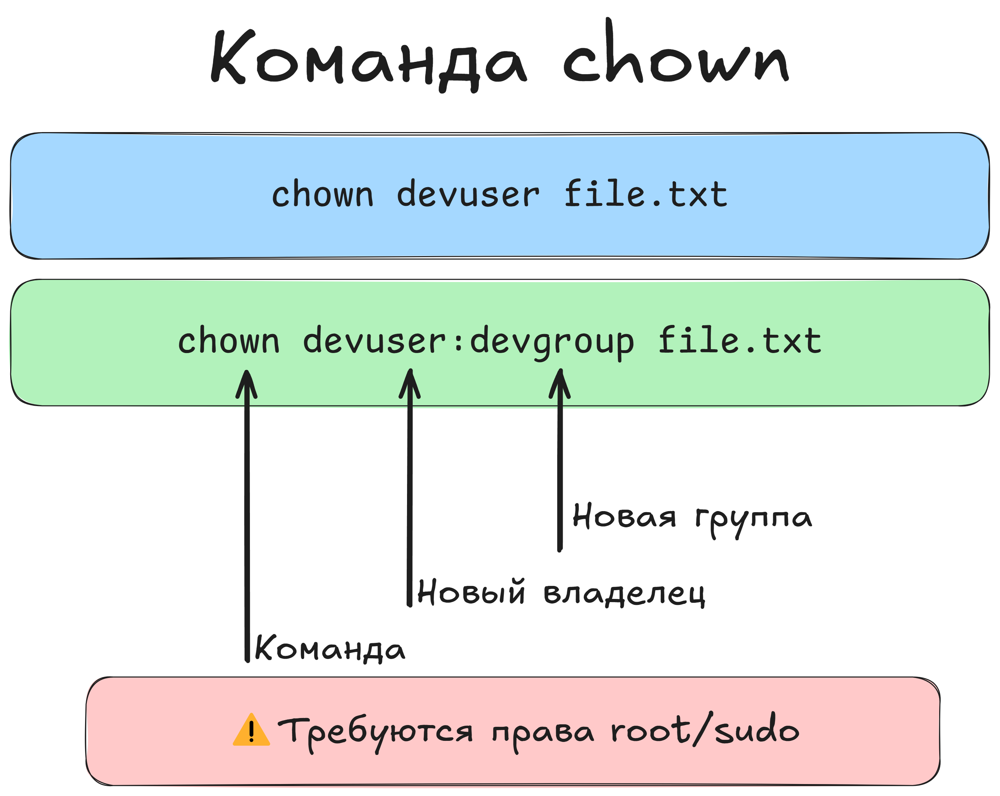
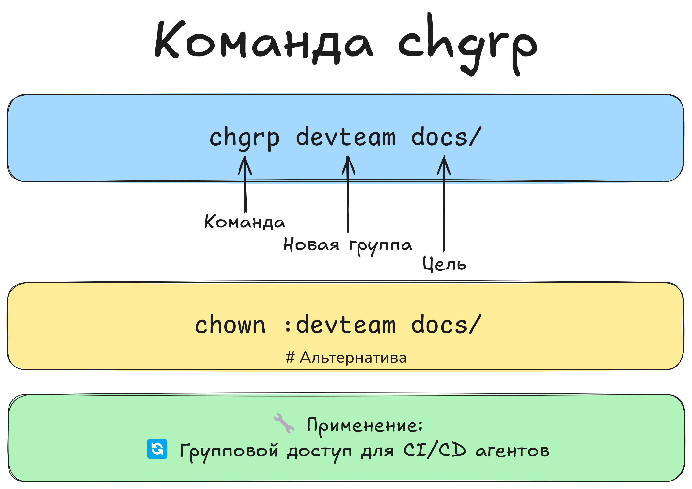

В Linux у каждого файла и каталога есть не только права (``r, w, x``), но и хозяева: конкретный пользователь (владелец) и группа. Понимание того, кто владеет файлом, и **умение менять владельца или группу** — важная часть управления доступом.

### **1. Кто владеет файлом?**
+ Когда вы смотрите ``ls -l``, то видите что-то вроде:
```
-rw-r--r--  1 username usergroup  4096 Aug 18 10:00 notes.txt
```
                  
Здесь ``username`` — владелец (``user``), ``usergroup`` — группа.
+ **Права доступа** разделяются именно по этим двум сущностям — владелец и группа, а все остальные пользователи попадают в категорию ``others``.
### **2. Смена владельца**
+ **Синтаксис:**
```
chown <новый_владелец> file.txt
```               
Обычный пользователь не может сменить владельца файла на другого пользователя. Для этого нужно использовать ``root`` или ``sudo``.

+ **Пример:**
+ ``sudo chown alice mydoc.txt`` — теперь пользователем-владельцем файла будет ``alice``.
+ Без ``sudo`` эта операция обычно не сработает, если вы не являетесь ``root`` или уже не владеете этим файлом.
+ **Смена владельца + группы одновременно:**
```
chown alice:staff mydoc.txt
```
                  
Теперь владелец будет ``alice``, группа — ``staff``.
+ **Рекурсивная смена** (``-R``):
```
sudo chown -R alice:staff /var/www/html
```
                  
Все файлы и каталоги внутри ``/var/www/html`` теперь принадлежат пользователю ``alice`` и группе ``staff``.  

   

### **3. Смена группы: chgrp**
+ **Синтаксис:**
```
chgrp <новая_группа> file.txt
```
                  
+ **Пример:**
```
sudo chgrp developers project/
```
                  
Установка для каталога project группы developers.
+ Это полезно, если вы не хотите менять владельца, а только переключить группу.
+ Аналогично поддерживается -R для рекурсивной смены.
 

 Чтобы добавить существующего пользователя в существующую (дополнительную) группу, используют команду:

``sudo usermod -aG developers alice``

```               
Здесь -aG означает «append to group» — добавить, не заменяя существующие группы.
```
### **4. Как создаётся владелец файла?**

+ Когда вы создаёте файл, владелец по умолчанию — это ваш пользователь, а группа — ваша основная группа (часто она совпадает с именем пользователя).
+ При копировании или перемещении файл может сохранит или изменить владельца/группу — это зависит от команды и настроек файловой системы (например, ``cp -a`` пытается сохранить права, владелиц и т. д.).
### **5. Просмотр доступных групп**
+ Вы можете увидеть, в каких группах состоит конкретный пользователь:
``groups alice``

                  
+ Чтобы посмотреть все группы в системе, загляните в файл ``/etc/group``.  

Команда groups ``<username>`` всегда показывает только список групп, к которым принадлежит пользователь. Она **не изменяет** группы.

### **Итог**
+ Каждый ``файл/каталог`` имеет **владельца** (``user``) и **группу**.
+ ``chown`` меняет владельца, а также группу (через двоеточие), если указать ``chown user:group file``.
+ ``chgrp`` меняет только группу.
+ Обе команды можно использовать рекурсивно (``-R``) для целых деревьев.