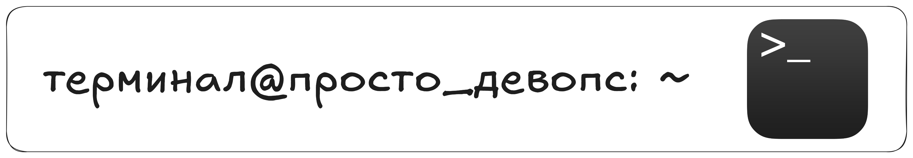

**Терминал** — это текстовый интерфейс, через который мы общаемся с операционной системой с помощью команд. В то время как **графический интерфейс** закрывает многие детали, терминал даёт доступ к ядру системы и позволяет выполнять целый спектр задач — от копирования файлов до запуска серверов и написания скриптов.

### **Что такое терминал**
+ **Окно или вкладка**, где вы вводите текстовые команды, а система отвечает текстом.
+ **Шелл (shell)** — программа внутри терминала, которая читает ваши команды и общается с ядром Linux. Самый распространённый шелл — **bash.**
+ **Альтернатива графическому интерфейсу.** Через терминал можно сделать всё, что угодно, часто даже быстрее, чем кликая мышкой по монитору.  

Терминал позволяет управлять системой через команды, но он **не используется для изменения внешнего вида графической оболочки (GUI).** Настройки тем, окон и иконок делаются через графический интерфейс.

### **Как открыть терминал**
+ На большинстве дистрибутивов Linux есть ярлык **Terminal** в меню приложений.

+ Можно воспользоваться комбинацией клавиш (например, ***Ctrl + Alt + T*** в Ubuntu и подобных системах) или найти в списке программ «Terminal», «Konsole», «GNOME Terminal» и т. д.  

+ На серверных системах без графического интерфейса терминал запускается автоматически (вы видите строку запроса логина).

### **Первое знакомство**
+ **Приглашение (prompt).** Обычно выглядит как ```user@hostname:~$```. У суперпользователя (```root```) приглашение обычно оканчивается символом ```#```, а у обычного пользователя — ```$```. Это позволяет легко отличить их. Здесь ```user``` — ваше имя пользователя, ```hostname``` — имя компьютера, ```~```указывает на домашний каталог.  

+ **Ввод команд.**  После значка ``$`` вы вводите команду (например, ``ls``), нажимаете ``Enter`` — и терминал выводит результат или сообщение об ошибке.

+ **История команд.** Нажмите стрелку вверх, чтобы пролистать ранее введённые команды. Это удобно при повторном использовании.

**Где искать справку по командам**
В Linux почти у каждой утилиты есть встроенная документация:

+ ``man <имя_команды>`` — открывает подробное руководство (manual).

+ ``<имя_команды> --help`` — показывает краткое описание и список доступных опций.

+ ``tldr <имя_команды>`` — альтернативный формат справки в виде коротких и наглядных примеров (нужно установить отдельно: ``sudo apt install tldr для Debian/Ubuntu`` или ``sudo dnf install tldr для Fedora``).

В следующих уроках мы научимся базовым командам навигации, чтобы уверенно путешествовать по файловой системе с помощью терминала. А пока можете просто открыть терминал и ввести ``ls``, чтобы убедиться, что всё работает!