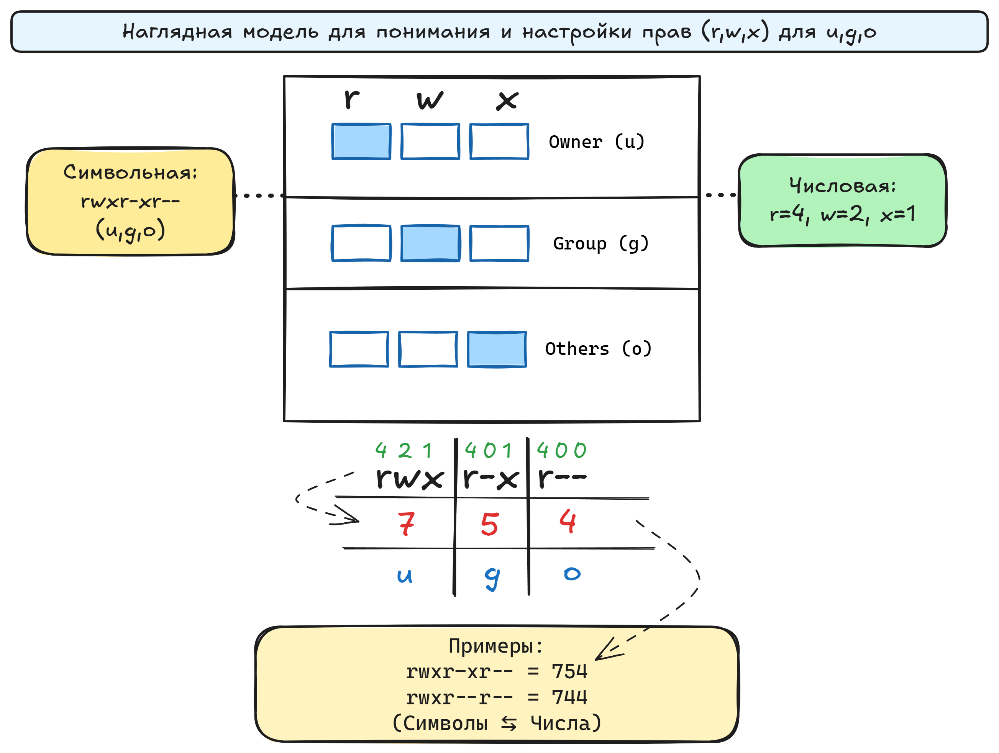

Одна из ключевых особенностей Linux – **гибкая модель прав доступа.** Изначально система задумывалась многопользовательской, и поэтому управление тем, кто и что может делать с файлами и директориями, является критически важным. В этом уроке мы рассмотрим базовую концепцию прав, а в следующем поговорим о том, как их изменять.

### **Модель rwx (Чтение, Запись, Исполнение)**
+ ``r (read)`` — право чтения файла (или просмотра содержимого каталога).
+ ``w (write)`` — право записи, редактирования (или создания/удаления/переименования внутри каталога).
+ ``x (execute)`` — право исполнения, если это файл-программа (или вход в каталог, если это директория).
### **Три категории: владелец, группа и остальные***
+ **Владелец (Owner)** — пользователь, которому принадлежит файл или каталог.
+ **Группа (Group)** — набор пользователей, которые могут иметь общий набор прав.
+ **Остальные (Others)** — все прочие пользователи, не владелец и не входящие в группу.
Таким образом, для каждого файла (или каталога) мы имеем **3 набора прав (r, w, x)**, умноженные на **3 категории пользователей (Owner, Group, Others)**:  

```
rwx  r-x  r--
 ↑     ↑    ↑
Owner  Group Others
```



### **Посмотрим на пример с помощью ls -l**
Если ввести ls -l в каталоге, мы увидим что-то вроде:
```
-rw-r--r--  1 user group 4096 Aug 10 12:34 notes.txt
drwxr-xr-x  2 user group 4096 Aug 10 12:35 projects
```
                  
+ **Первый символ:**
+ ``-`` (дефис) означает обычный файл.
+ ``d`` означает директория.
+ **Следующие 9 символов** разбиваются на три группы по 3 символа:
+ ``rw-`` — права владельца (``r`` = чтение,``w``= запись, ``x`` = нет).
+ ``r-``- — права группы (``r`` = чтение, ``w`` = нет, ``x`` = нет).
``r--`` — права остальных (``r`` = чтение, ``w`` = нет, ``x`` = нет).
+ **Далее** в колонках указаны:
+ Кол-во жёстких ссылок (``1 или более``).
+ Имя владельца (``user``).
+ Имя группы (``group``).
+ Размер файла (``4096 байт``).
+ Дата изменения.
+ Имя файла или каталога.
Для директории projects мы видим ``drwxr-xr-x``:

+ ``d`` – значит это каталог.
+ ``rwx (для владельца)`` – владелец может заходить в каталог (``x``) и читать/писать файлы (``r``, ``w``).
+ ``r-x`` (для группы) – группа может читать и заходить, но не писать.
+ ``r-x`` (для остальных) – аналогично группе.
 

### **Понимание прав для каталогов**
+ ``r (read)`` — смотреть список файлов в каталоге.
+ ``w (write)`` — создавать, удалять и переименовывать файлы/папки внутри этого каталога.
+ ``x (execute)`` — войти в каталог (использовать ``cd``), а также обращаться к файлам внутри него.  

Важно не путать это с правами файлов. Наличие w на файле ``myfile.txt`` — это одно, а наличие ``w`` в каталоге ``docs/`` — это другое.

⚠️ Важно различать права на **файл** и на **каталог**, где он лежит:

+ Право ``w`` на файл ``→`` вы можете редактировать содержимое, но не удалять или переименовывать сам файл.

+ Удаление или переименование файла зависит от права ``w`` на каталог, где он находится.

+ Чтобы создать новый файл в каталоге, нужны сразу два права: ``w`` (создание/удаление объектов) и ``x`` (возможность войти и работать внутри).

### **Итог**
+ Linux использует **модель rwx** (чтение, запись, исполнение) отдельно для владельца, группы и остальных.
+ ``ls -l`` показывает права, разбитые на 3 блока по 3 символа (например, ``-rw-r--r--`` или ``drwxr-xr-x``).
+ Для каталогов x означает разрешение «входить» и выполнять внутри команды, ``r`` — перечислять файлы, ``w`` — изменять содержимое каталога (создавать, удалять файлы).  

Теперь вы знаете, как читать права доступа у файлов и каталогов. В следующем уроке мы узнаем, как эти права изменить (команда chmod) и тем самым управлять, кто что может делать с вашими данными.