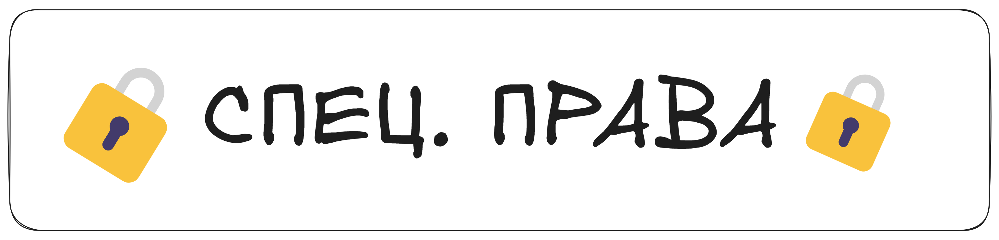
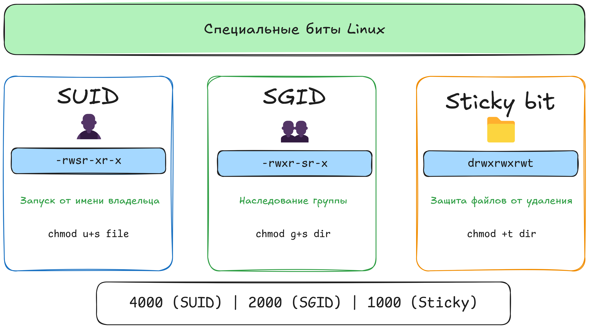

В дополнение к привычным правам ``r``, ``w``, ``x`` (чтение, запись, исполнение), в Linux есть особые флаги — ``SUID``, ``SGID`` и ``Sticky bit``, которые меняют модель поведения файлов и каталогов. Ниже краткий обзор, зачем они нужны и как их использовать.

### **SUID (Set User ID)**
+ **Что даёт.** Если на исполняемом файле (программе) установлен ``SUID``, то при запуске этой программы она работает с правами владельца файла, а не пользователя, который её запустил.
+ **Пример.** Утилита ``passwd`` (для смены пароля). Владельцем этого файла обычно является ``root``, и у него стоит ``SUID``. Это позволяет любому пользователю менять свой пароль (записывать в системный файл ``/etc/shadow``, на что обычные права не распространяются).
+ **Как установить:**
```
chmod u+s file
```
                  
Или в числовом формате: добавить цифру ``4`` к старшим правам (на место тысяч). Например, chmod ``4755 file``.
+ **Риск.** Запуск ``SUID-программ`` от``root`` может быть небезопасен, если программа уязвима, ведь она получает привилегии владельца (``root``).
**Важно:** при ``SUID`` процесс программы выполняется с эффективным ``UID`` владельца файла, но ваш пользователь не меняется. Это не «становление ``root``», а привилегии именно для процесса.
```
chmod u+s file
```
                  
или в числовом формате: ``chmod 4755 file``.

### **SGID (Set Group ID)**
+ **Для файлов.** Аналогично SUID, но распространяется на группу. При запуске такого файла его процесс получает права группы, которая владеет файлом.
+ **Для каталогов.** Более частый сценарий: если каталог имеет ``SGID``, то все новые файлы и подпапки, созданные в нём, наследуют группу каталога (а не основную группу пользователя, создавшего файл). Это удобно, когда вы ведёте общий проект и хотите, чтобы все файлы автоматически принадлежали одной группе.
```
chmod g+s mysharedfolder
```
                  
Теперь, всё, что появится в ``mysharedfolder``, автоматически получит группу, владеющую этой папкой.
+ **Числовой режим** — ``2`` добавляется к старшим разрядам. Например, ``chmod 2775 folder`` (вместо ``775``).
Если на каталоге установлен ``SGID``, **все новые файлы и папки** внутри будут наследовать группу каталога.

### **Sticky bit**
+ **Директории.** Если на каталоге выставлен ``Sticky bit``, то удалить/переименовать файлы внутри могут только владелец файла (или ``root``), даже если у каталога стоят общие права на запись. Классический пример — ``/tmp`` (все могут записывать туда, но никто не может удалить чужой файл).
```
chmod +t /tmp
```
                  
+ В выводе ``ls -l`` вместо ``x`` ``у`` ``others`` будет буква ``t``. Например, ``drwxrwxrwt``.
+ **Числовой режим** — ``1`` добавляется к старшему разряду (например, ``1755``).



### **Как это выглядит в ls -l?**
+ **SUID** — бит ``s`` вместо ``x`` ``у`` владельца (``Owner``). Пример: ``-rwsr-xr-x``.
+ **SGID** — бит ``s`` вместо ``x`` ``у`` группы (``Group``). Пример: ``-rwxr-sr-x или + drwxr-sr-x (для каталогов).``
+ **Sticky bit** — бит ``t`` вместо ``x`` ``у`` «``others``». Пример: ``drwxrwxrwt``.
+ ``s`` у владельца → ``SUID (-rwsr-xr-x)``

+ ``s`` у группы → ``SGID (-rwxr-sr-x)``

+ ``t`` у others → ``Sticky bit (drwxrwxrwt)``

### **Итог**
+ **SUID (Set User ID)** — запускает программу с правами владельца файла.
+ **SGID (Set Group ID)** — запускает программу с группой файла или заставляет новые файлы в каталоге наследовать группу.
+ **Sticky bit** — защищает файлы в общем каталоге от удаления или переименования не их владельцем.
+ **Числовые добавки:**
    + 4xxx — SUID
    + 2xxx — SGID
    + 1xxx — Sticky bit  

Эти специальные биты широко применяются в системах с несколькими пользователями — для организации общих папок (``SGID + Sticky``), в администраторских утилитах (``SUID``), а также чтобы предотвратить утечку важных данных в общедоступных каталогах (``Sticky``).