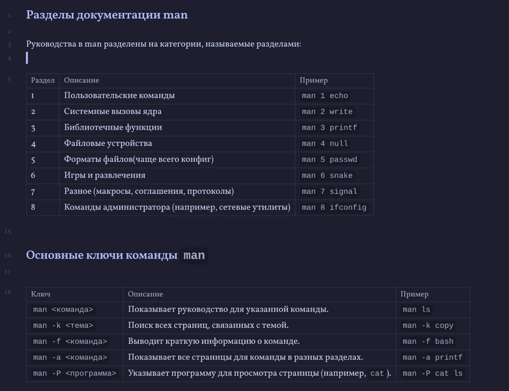

В мире Linux существует несколько способов быстро получить справку по командам, утилитам и параметрам. Это удобно, если вы не хотите искать в интернете и предпочитаете держать все под рукой в самом терминале.  

### **man**  

+ **Manual pages (man-страницы)** — основной справочник по командам, системным вызовам, конфигурационным файлам и многому другому.
+ **Использование:**  

``man <команда>``

                  
Например, ``man ls`` покажет детальное описание команды ``ls``, её опции и формат.
+ **Навигация:**
+ Стрелки или PgUp/PgDn, чтобы прокручивать текст.
+ ``/`` — поиск по ключевым словам (после ввода ``/`` наберите слово и нажмите ``Enter``).
+ ``Q`` — выход из просмотра.
+ Разделы ``man``:
+ 1: Пользовательские команды (``ls``, ``cd``, ``ps``, и т.д.)
 + 5: Форматы файлов и конфигурации (``fstab``, ``passwd``)
 + 8: Администраторские команды (``fdisk``, ``ifconfig``)
Иногда одну и ту же команду или слово можно встретить в разных разделах, тогда команда может выглядеть так: ``man 5 passwd``, чтобы посмотреть формат файла ``passwd`` (раздел 5).
Чтобы открыть ``man-страницу`` в определённом разделе, можно указать его номер через опцию ``-s``.
+ **Например:**

``man -s 5 passwd``

                  
Это то же самое, что и ``man 5 passwd``.

### **info**
+ ``info <утилита>`` — альтернативная система документации, более «гипертекстовая».
+ Часто встречается в GNU-проектах (например, ``info coreutils``).
+ **Навигация:**
+ Стрелки для прокрутки, ``Enter`` для перехода по ссылкам.
+ ``Q`` — выход, ``N`` или ``P`` — переход к следующему/предыдущему узлу документа.
+ Если ``info`` говорит, что документации нет, значит её могли просто не установить или она не поставляется в виде ``info-страниц``.
### **--help**
+ Многие команды в Linux поддерживают опцию ``--help`` или ``-h`` (короткий формат).
+ **Пример:**  

    ``ls --help``

                  
Вы увидите список доступных параметров и пример использования.
+ **Полезно**, когда нужно вспомнить конкретную опцию, не углубляясь в длинную ``man-страницу``.
### **help (встроенная в shell)**
+ Некоторые команды — это встроенные функции ``bash`` (например, ``cd``, ``echo`` в некоторых шеллах). Для них man может не сработать.
+ **Пример:**  

    ``help cd``

                  
Покажет краткое описание встроенной команды cd.
+ Аналогично можно сделать ``help history``, ``help alias`` и т.д.
### **apropos**
+ Если вы не знаете точное название команды, но знаете ключевое слово, можно воспользоваться ``apropos <слово>``.
+ Пример:  

    ``apropos "directory"``

                  
Выведет список команд и страниц ``man``, где встречается слово ``directory``.
### **Итог**
+ ``man`` — основной справочник (``man-страницы``). ``man ls``, ``man passwd``, ``man 5 passwd`` и т.д.
+ ``info`` — часто более детальное руководство для утилит GNU (гипертекстовая форма).
+ ``--help`` ``/ -h``— мгновенный краткий список опций для конкретной команды.
+ ``help`` — справка по встроенным командам шелла (``bash builtins``).
+ ``apropos`` — ищет по описаниям ``man-страниц``, если вы знаете о чём, но не знаете точное название команды.  

📌 Краткий список основных способов получить справку:

man <команда> — подробная документация;

info <команда> — гипертекстовое руководство GNU;

<команда> --help или -h — краткая справка по опциям;

help <команда> — справка по встроенным командам bash;

apropos <ключевое слово> — поиск по описаниям man-страниц.

С этими инструментами вы можете разобраться в любой незнакомой команде прямо в терминале, без интернета и подсказок. В дальнейшем, когда мы будем знакомиться с новыми программами, не стесняйтесь сразу использовать ``--help`` или man, чтобы узнать больше о доступных опциях.  

