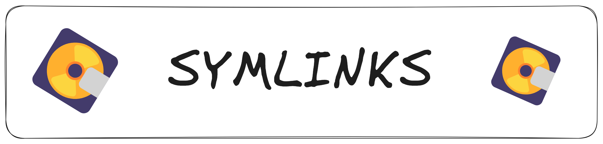
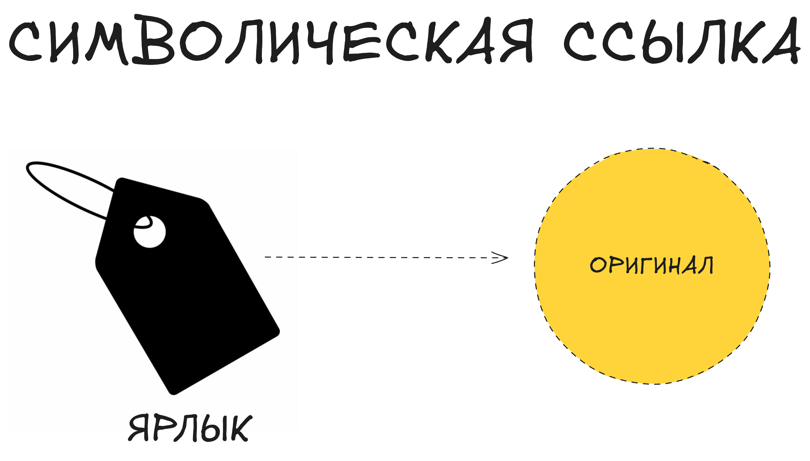

Если **жёсткие ссылки (hard links)** создают альтернативные имена для одного и того же файла на уровне inode, то **символические ссылки (symlinks**) работают как ярлыки: они просто хранят путь к другому файлу или каталогу. Это даёт большую гибкость, но и несколько другую логику поведения.

### **Создание символических ссылок**

``ln -s <оригинал> <ссылка>``  

+ **Пример:**  
```
ln -s /home/user/docs/book.txt link_to_book.txt
```
                  
Теперь файл ``link_to_book.txt`` является символической ссылкой, указывающей на ``/home/user/docs/book.txt``.
### **Основные отличия от жёстких ссылок**
1. **Указывает на путь, а не на inode**
+ Символическая ссылка знает только имя оригинала. Если исходный файл переименовать или удалить, ссылка сломается (битая ссылка).
2. **Можно ссылаться на каталоги**
+ В отличие от **жёстких ссылок**, создать **symlink** на папку обычно не проблема.
3. **Работает между файловыми системами**
+ Поскольку хранит путь, символическая ссылка может указывать на объект на другом разделе или сетевом ресурсе.  



### **Как узнать, что это symlink?**
+ ``ls -l`` показывает что-то вроде:  
```
lrwxrwxrwx 1 user group 14 Aug 25 10:00 link_to_book.txt -> /home/user/docs/book.txt
```
                  
Буква ``l (L)`` вначале означает ``link``, а после стрелки ``->`` видно, куда она указывает.  

+ **В начале строки в выводе ls -l у символической ссылки всегда стоит буква l.**

+ ``ls -l link_to_book.txt`` покажет права ``rwxrwxrwx``. В ``ls -l`` символическая ссылка почти всегда отображается как имеющая права ``rwxrwxrwx``. Это права самой ссылки (ярлыка), а не оригинального файла.
### **Примеры использования**
+ **Сократить длинный путь:**
```
ln -s /opt/myproject/config /home/user/config_shortcut
```
                  
Теперь вы можете открывать ``/home/user/config_shortcut`` вместо длинного оригинала.
+ **Организация каталогов:**
+ Если один файл нужен одновременно в двух местах, вместо копирования сделайте ``symlink``. Например, в папке ``/var/www/html`` лежит ссылка на файлы в ``/home/user/site``.
### **Что если оригинал удалён или перемещён?**
+ Символическая ссылка продолжает указывать на старый путь. Если файл переименовать/удалить, ссылка ломается и при попытке открыть её вы получите ошибку: ``No such file or directory``.
+ **Решение:** нужно вручную обновить или пересоздать ссылку, чтобы она указывала на новое местоположение.
+ **Путь в символической ссылке нельзя изменить напрямую. Если файл переместился, нужно пересоздать ссылку.**
### **Символические ссылки и команды**
+ ``cp link`` копирует саму ссылку или файл, на который она указывает, в зависимости от опций:
+ ``cp link another_place`` обычно скопирует файл-ярлык (сохранив его путь).
+ ``cp -L link another_place`` перед копированием разыменует ссылку — то есть скопирует реальный файл.
+ ``rm link`` удалит саму ссылку, а не содержимое файла. Если хотите удалить оригинальный файл, нужно удалить его путь напрямую.
+ ``cp link`` копирует сам ярлык.

+ ``cp -L link`` копирует содержимое файла, на который указывает ссылка.

📌 **Сравнение жёстких и символических ссылок:**  
```
Жёсткая ссылка (hard link) указывает на inode файла.

Символическая ссылка (symlink) хранит только путь к оригиналу.

Hard link нельзя создать на другом разделе, symlink — можно.

Hard link обычно нельзя создать на каталог, symlink можно.

Если удалить оригинал: hard link продолжает работать, а symlink ломается.
```
### **Итог**
+ ``ln -s`` создаёт «ярлык» (``symbolic link``), который хранит путь к исходному объекту.
+ **Возможность ссылаться на каталоги** и располагаться на другом разделе — важное преимущество ``symlink``.
+ **Хрупкость:** если исходный файл перемещён/удалён, ссылка «``ломается``», так как она не знает об изменении пути.
+ **Отлично подходит для «объединения» файлов** и папок в разных местах, экономя место (ведь реальных данных она не копирует).  

Символические ссылки (symlinks) — универсальный инструмент, используемый повсюду: от системных директорий (/etc/alternatives) до пользователя (создание удобных ярлыков). В отличие от жёстких ссылок, они проще в управлении, но могут сломаться, если источник перестаёт существовать или меняет расположение.