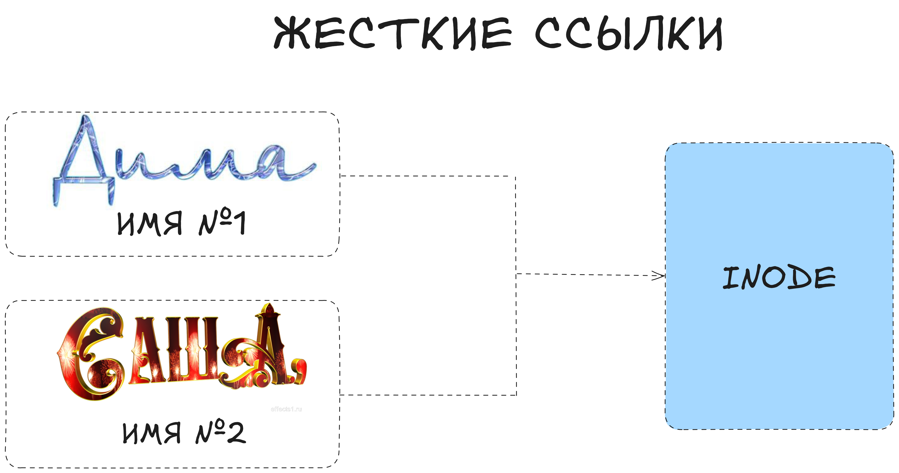

В Linux **жёсткие ссылки (hard links)** позволяют иметь несколько имён для одного и того же файла — то есть несколько путей ссылаются на одни и те же данные на диске. Это может быть полезно, если вы хотите клонировать файл, но при этом сделать так, чтобы изменения в одном месте автоматически появлялись в другом.

### **Что такое inode?**
+ На диске у каждого файла есть ``inode`` — структура, которая описывает данные (где они лежат, какие права и т. д.).
+ Обычное имя файла (в каталоге) ссылается на этот ``inode``.
+ ``Hard link`` — ещё одно имя, которое указывает на тот же самый ``inode``.
### **Как это выглядит на практике?**
+ **Создадим обычный файл:**
```
echo "Hello world" > myfile.txt
```
                  
+ **Проверим ссылки:**
```
ls -l myfile.txt
```
                  
+ **Допустим вы увидите что-то вроде:**
```
-rw-r--r-- 1 user group 12 Aug 20 10:00 myfile.txt
```
                  
``1`` — означает, что у файла пока одна жёсткая ссылка (имя ``myfile.txt``).

+ **Создадим жёсткую ссылку:**
```
ln myfile.txt mylink.txt
```
                  
Теперь ``mylink.txt`` указывает на тот же ``inode``.  

+ **Снова посмотрим:**  
```
ls -l
```
                  
**Вы можете увидеть (примерный вывод):**  
```
-rw-r--r-- 2 user group 12 Aug 20 10:00 myfile.txt
-rw-r--r-- 2 user group 12 Aug 20 10:00 mylink.txt
```
                  
Обратите внимание, что ``2`` теперь означает «количество имён (жёстких ссылок) на этот ``inode``».



### **Что это даёт?**
+ **Один и тот же файл** — разные имена: Если вы откроете ``mylink.txt`` и поменяете там содержимое, то изменения будут видны и в ``myfile.txt``. По сути, это две двери в одну и ту же комнату.
+ **Не тратит дополнительное место:** хард-линк делит ту же область на диске, не копируя данные.
+ **Безопасность удаления:** если вы удалите ``myfile.txt``, но оставите ``mylink.txt``, данные физически сохранятся. Система уменьшит счётчик ссылок (с ``2`` до ``1``), а ``inode`` всё ещё используется.
### **Ограничения**
+ **Разные файловые системы.** Вы не можете создать хард-линк на другом разделе или диске, потому что каждый ``inode`` уникален в пределах одной файловой системы.
+ **Директории.** По умолчанию в большинстве дистрибутивов создавать жёсткие ссылки на каталоги запрещено (во избежание зацикливания структуры).
### **Как определить, что файлы связаны?**

+ ``ls -l`` — обращайте внимание на число ссылок (вторая колонка), оно будет ``>=2``.
+ ``ls -i`` — покажет номера ``inode``. Если у файлов один ``inode``, значит это жёсткие ссылки.  
```
ls -i
198527 myfile.txt 198527 mylink.txt
```
                  
Числа совпадают: это один и тот же ``inode``.  

Самый надёжный способ проверить, что файлы указывают на один и тот же ``inode`` — использовать ``ls -i``. Эта команда показывает номера ``inode``, и если они совпадают, значит это жёсткие ссылки.

Надёжные признаки жёстких ссылок:

+ Совпадает номер ``inode (ls -i)``,

+ Число ссылок во второй колонке ``ls -l ≥ 2``.  

⚠️ При этом права доступа или расположение в одной директории не гарантируют, что это жёсткие ссылки.

### **Итог**
+ **Жёсткие ссылки (hard links)** — несколько имён, указывающих на один и тот же ``inode`` (физический файл).
+ ``ln`` — команда для создания такой ссылки: ``ln <исходник> <ссылка>``.
+ **Данные общие**, изменили в одном — автоматически меняется в другом.
+ **Не работают** между разными файловыми системами или дисками, и обычно не создаются на папки.  

Жёсткие ссылки могут быть полезны в сценариях, где нужно иметь резервные имена для файла или разносить его в разные директории без дублирования данных. В следующем уроке мы рассмотрим символические ссылки (``symlinks``), которые более гибки и умеют указывать даже на каталоги (но при этом чуть иначе ведут себя при удалении исходного файла).