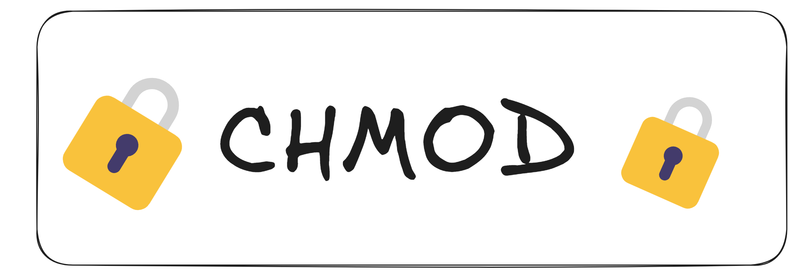
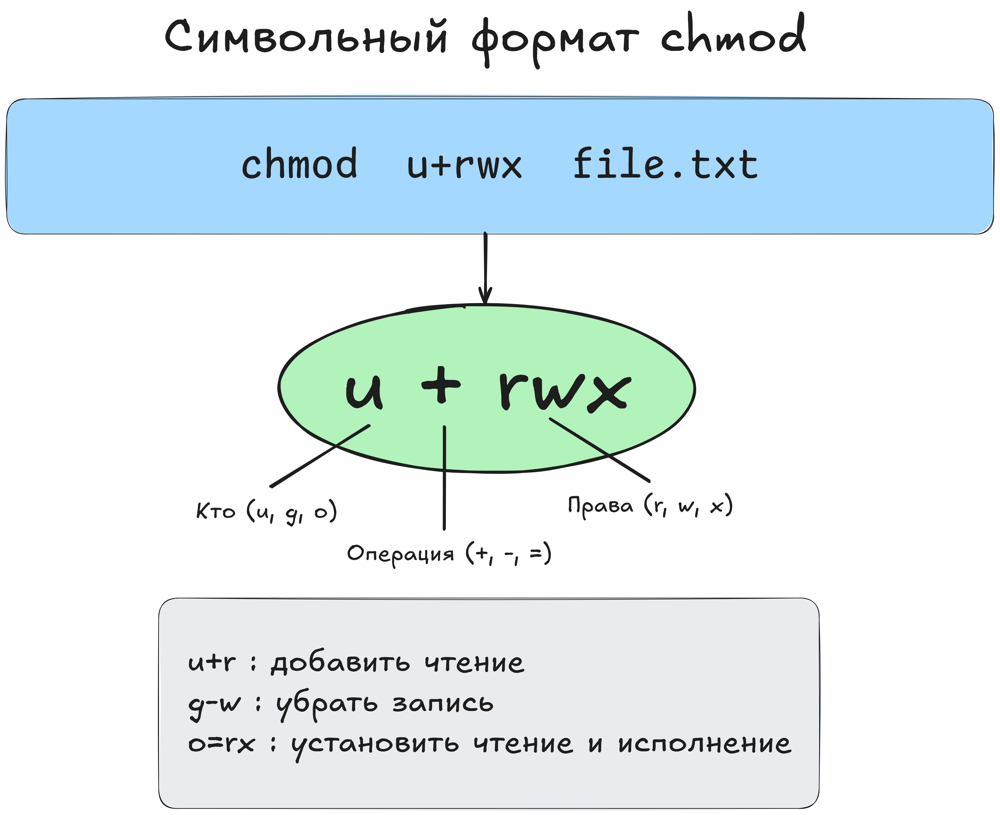

В предыдущем уроке мы узнали, что права доступа к файлам и каталогам в Linux делятся на ``r`` (чтение), ``w`` (запись) и ``x`` (исполнение), а также распределяются по категориям: владелец (owner), группа (group) и остальные (others). Теперь посмотрим, как менять эти права.

### **chmod (изменение прав)**
Для изменения прав используется команда ``chmod`` (от change mode). Мы можем указывать права двумя способами:

+ **Символический метод** (``u``, ``g``, ``o``, ``a + r``, ``w``, ``x``)
+ **Восьмеричный метод** (числовой, например, ``755``, ``644``)
### 1. Символический метод
+ Мы указываем, к чьим правам обращаемся:
    * ``u`` — владелец (user)
    * ``g`` — группа (group)
    * ``o``— остальные (others)
    * ``a`` — все сразу (u, g и o вместе)
+ И что делаем с правами:
    * ``+``добавить
    * ``-`` убрать
    * ``=`` установить точное значение
+ **Пример:**  

  ``chmod u+r file.txt``

                  
Это значит: «владельцу (``u``) добавить ( ``+`` ) право чтения (``r``)» к файлу ``file.txt``.
+ **Другой пример:**  

    ``chmod g+w file.txt``

                  
«группе (``g``) добавить ( ``+`` ) право записи (``w``)».
+ **Комбинации:**  

  ``chmod u+x,g-x file.sh``

                  
«добавить выполнение (``x``) владельцу (``u``) и убрать (``x``) у группы (``g``)».  




Эти буквы можно комбинировать:

* ``u`` — владелец (``user``),

* ``g``— группа (``group``),

+ ``o`` — остальные (``others``),

+ ``a`` — все сразу (``u+g+o``).

### **2. Восьмеричный (числовой) метод**
+ Каждая тройка ``rwx`` переводится в число от ``0`` до ``7``:
+ ``r = 4``, ``w = 2``, ``x = 1`` — складываем. Например, ``rwx = 4+2+1 = 7``.
+ Набор ``r-- = 4+0+0 = 4``, ``rw- = 4+2+0 = 6``, и т. д.
+ Итого, права вида ``rwxr-xr-x (это 755)`` в числовом формате обозначаем chmod ``755 file.sh``.  

+ **Примеры:**
+ ``chmod 644 file.txt — rw-r--r--``
+ ``chmod 755 script.sh — rwxr-xr-x``
```
Подсказка: «744» означает rwx для владельца (7) и r-- для группы (4) и остальных (4).

Часто используемые значения:

600 — владелец может читать и писать, остальные не имеют доступа (типичный вариант для приватных ключей SSH).

700 — владелец может читать, писать и исполнять, остальные не имеют доступа.

644 — владелец может читать и писать, остальные только читать (обычный вариант для текстовых файлов).
```
### **Рекурсивное изменение прав**
+ ``-R (или --recursive)`` позволяет применять новые права ко всем файлам и папкам внутри заданного каталога.  

    ``chmod -R 755 /var/www/html``

                  
Теперь все файлы в ``/var/www/html`` будут иметь права ``rwxr-xr-x``.  

+ **Осторожность:** Рекурсивное изменение может «сломать» что-то, если назначить неправильные права системным файлам.  
```
📌 Для изменения прав во всех вложенных файлах и папках используйте флаг -R (recursive).
```
### **Практические советы**
+ **Скрипты и программы.** Чтобы файл стал исполняемым, владельцу (или всем) нужно добавить ``x``:  

    ``chmod u+x script.sh``

                  
+ **Конфиденциальные данные.** Возможно, нужно убрать чтение для группы и остальных:  

    ``chmod go-r file.conf``

                  
Теперь только владелец может читать этот файл.
* **Перестраховка.** Если сомневаетесь, установите ``chmod 600`` (только владелец может читать и писать) — полезно для ключей SSH и паролей.
### **Итог**
+ ``chmod`` позволяет поменять права с помощью символических (``u``, ``g``, ``o``, ``+``, ``-``, ``=``) или числовых (``744``, ``755``, ``600`` и т. д.) методов.
+ ``-R (рекурсивная)`` опция изменяет права во всех подкаталогах, будьте внимательны.
+ Владея этим, вы контролируете, кто может читать, изменять или запускать файлы и программы.  

Теперь вы можете не только читать, какие у файла права, но и устанавливать их так, как нужно. В следующем уроке поговорим о том, как назначать владельца или группу (команды chown и chgrp), а также познакомимся со специальными битами (suid, sgid, sticky).